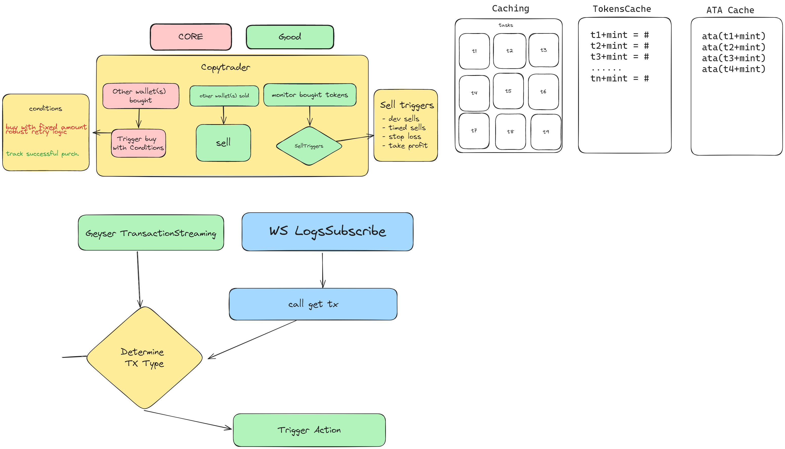

## current plan



## code requirements
- testable
- extreme error/exception handling
- focus on speed

## compile

Need tool arguments, go args:

```shell
-ldflags "-X 'Zed/ui.WhiteLabel=Zed'"
```

full example:

```shell
go build -ldflags "-X 'Zed/ui.WhiteLabel=Zed'"
```